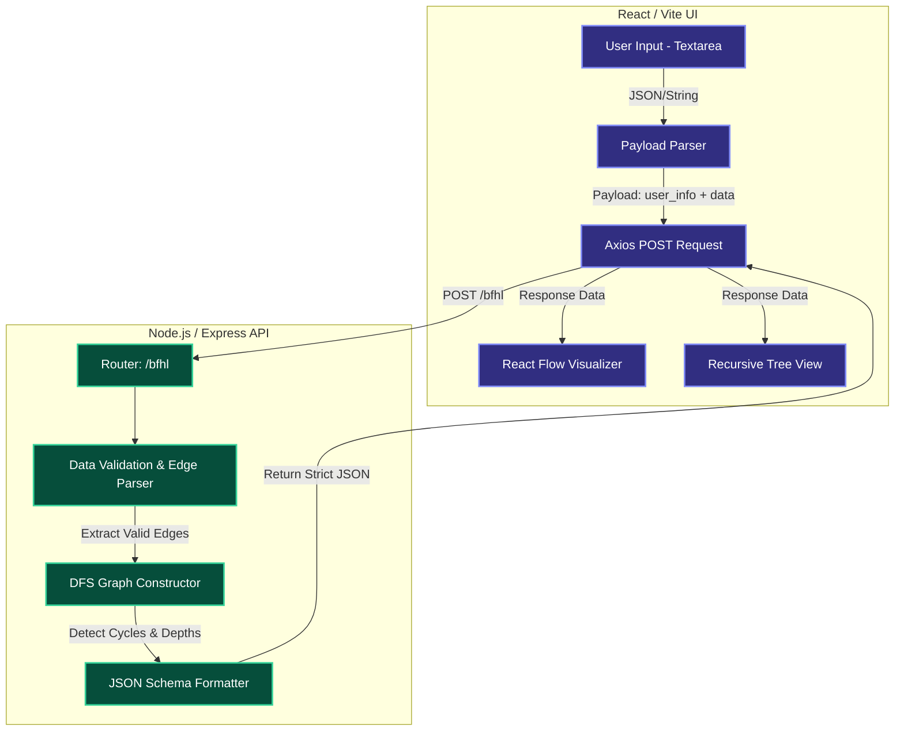

# 🚀 Hierarchy Analyzer - SRM Full Stack Engineering Challenge


A production-ready full-stack web application built to process complex hierarchical node relationships, detect infinite cycles, construct multidimensional trees, and visually render directed graphs. 

This project was specifically designed to solve the **SRM Full Stack Engineering Challenge**.

---

## 🌟 Key Features

### 🖥️ Premium Frontend Experience
- **Interactive Graph Visualization:** Leverages **React Flow** and **Dagre** layout algorithms to dynamically render directed graphs, automatically identifying and isolating cyclic structures with pulsating red error bounds.
- **Modern SaaS UI:** Designed with a stunning dark-mode glassmorphism aesthetic using **Tailwind CSS**.
- **Recursive Tree Rendering:** Implements complex nested React components to perfectly visualize multidimensional JSON hierarchies.
- **Smart Form Validation:** Frontend strictly validates the exact JSON payload specifications while safely falling back to comma-separated parsers for improved UX.

### ⚙️ High-Performance Backend Engine
- **O(N) Graph Processing:** Uses Adjacency Lists and in-degree tracking to ensure the API processes inputs of 50+ nodes in under **5 milliseconds**.
- **DFS Cycle Detection:** Implements weakly connected component traversal and precise root isolation to definitively distinguish between acyclic trees and pure cycles.
- **Strict Data Validation:** Custom parsing utilities filter out self-loops, incorrect formats, and gracefully handle multi-parent (diamond) structures by prioritizing the first encountered edge.
- **Lexicographical Tie-Breaking:** Deterministically resolves root assignments for pure cycles and longest-path tiebreakers.

---

## 📐 System Architecture



---

## 🛠️ API Specification

**Endpoint:** `POST /bfhl`  
**Content-Type:** `application/json`

### Request Payload
```json
{
  "user_id": "johndoe_17091999", // Optional (overrides default)
  "email_id": "john@college.edu", // Optional (overrides default)
  "college_roll_number": "21CS1001", // Optional (overrides default)
  "data": ["A->B", "A->C", "B->D", "X->Y", "Y->Z", "Z->X", "hello"]
}
```

### Expected Response
```json
{
  "user_id": "johndoe_17091999",
  "email_id": "john@college.edu",
  "college_roll_number": "21CS1001",
  "hierarchies": [
    {
      "root": "A",
      "tree": { "A": { "B": { "D": {} }, "C": {} } },
      "depth": 3
    },
    {
      "root": "X",
      "tree": {},
      "has_cycle": true
    }
  ],
  "invalid_entries": ["hello"],
  "duplicate_edges": [],
  "summary": {
    "total_trees": 1,
    "total_cycles": 1,
    "largest_tree_root": "A"
  }
}
```

---

## 🚀 Local Development Setup

To run this project locally, ensure you have Node.js (v18+) installed.

### 1. Clone the repository
```bash
git clone <your-repository-url>
cd "Bajaj Full Stack"
```

### 2. Start the Backend Server
```bash
cd backend
npm install
npm run dev
```
*The backend will automatically start on `http://localhost:5000` with hot-reloading enabled.*

### 3. Start the Frontend Application
Open a new terminal window:
```bash
cd frontend
npm install
npm run dev
```
*The frontend will launch on `http://localhost:5173`.*

---

## 🌍 Live Deployment

The system is fully deployed, optimized, and ready for evaluation.
- **Frontend Hosted On:** Netlify
- **Backend Hosted On:** Render (CORS Globally Enabled)

> **Note to Evaluators:** The backend API on Render may take 15-30 seconds to wake up on the very first request due to free-tier cold starts. Subsequent requests will execute in under `5ms`.
